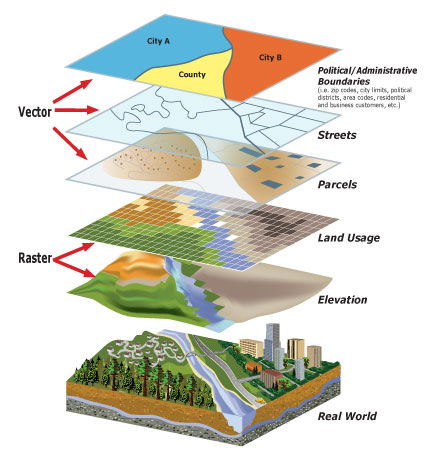

# Introduction to Geospatial Data with Python

Data comes in all shapes and sizes and often government data is geospatial in nature. Often times data science programs & tutorials ignore how to work with this rich data to make room for more advanced topics. Our MinneMUDAC competition heavily utilized geospatial data but was processed to provide students a more familiar format. But as good scientists, we should use primary sources of information as often as possible.

## Why use this Notebook?

Use this Notebook to get a basic understanding of how to read, write, query, perform geospatial calculations and join data sets together. Along the way you will see some tips to preprocessing data for analysis and some tricks to ensure you are computing efficiently. This Notebook is be focused on Minnesota Tax shapefiles, MetCouncil Water Features and MN PCA Lake Quality Attributes all of which were the focus of our [Dive Into Water (Data)](http://minneanalytics.org/minnemudac/) Competition. It is meant as a way to give you real data, real code and a real problem to work through. 

*Social Data Science hopes you take what you learn here and use it to improve the world around you!*

## [Open the .ipynb file with Jupyter Notebook to get started!](Intro%20to%20Geospatial%20Data%20with%20Python.ipynb)
